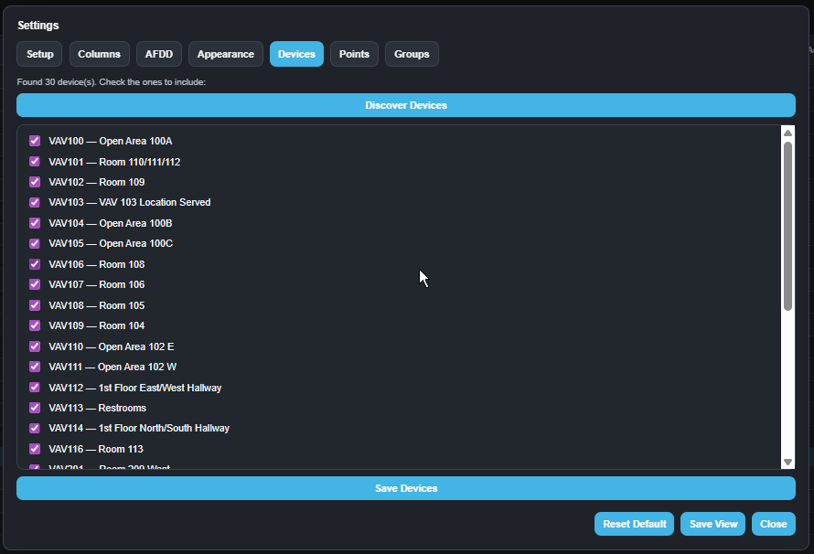
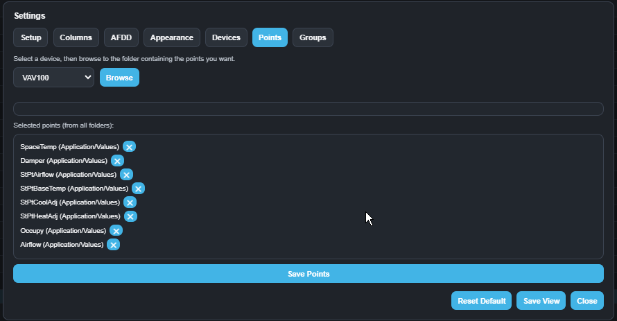
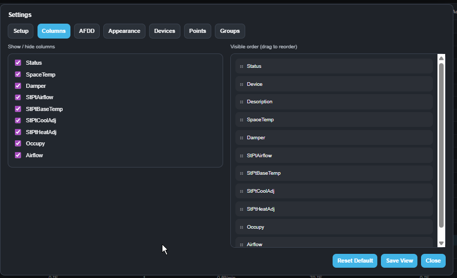
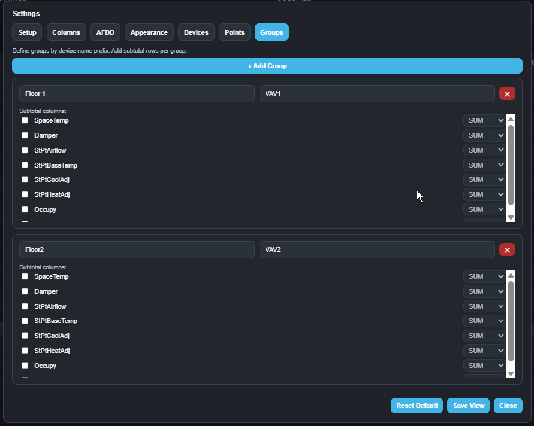
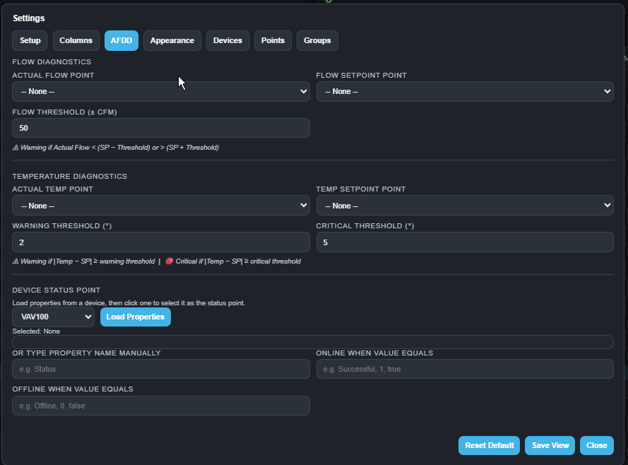

# AutoSummary

**AutoSummary** is compatible with Schneider Electric EcoStruxure™ Building Operation (EBO) (tested with Version 7).

It provides a fast, configurable summary screen. Discover devices, select points, and generate a live summary table—without building it piece by piece.

---

## Overview

AutoSummary allows you to:

- Discover devices from any EBO root path  
- Select and organize key points  
- Build a real-time summary table  
- Save configurations for reuse  

Configure once. Use indefinitely.

---

## Core Workflow

1. Set root path  
2. Discover devices  
3. Select points  
4. Configure table layout  
5. Save configuration  

---

## Requirements

AutoSummary requires minimal configuration within EBO.

### Server Configuration
Create string values at:

```
/ASP/Web/Config
```

---

### HTML Configuration

Modify the following lines in your HTML file:

#### 1. Client API Script (Approx. Line 893)

**Live ASP:**
```html
<script src="/publicweb/client_api.js"></script>
```

**PCT:**
- Must reference via Web Link

---

#### 2. Configuration Path (Approx. Line 897)

```javascript
const CONFIG_BASE = "/NAME_OF_ASP/Web/config";
```

---

## Setup

### 1. Set Root Path

Define the location of your devices in EBO.

**Example:**
```
/Server/Network/CommPort/VAVs
```

---

### 2. Discover Devices

- Click **Discover Devices**
- Select devices to include



---

### 3. Select Points

- Choose a device  
- Navigate object folders  
- Select required points (e.g., SpaceTemp, Damper, Airflow)



---

### 4. Configure Columns

- Show or hide columns  
- Reorder via drag-and-drop  



---

### 5. Grouping (Optional)

Group devices using naming patterns.

**Example:**
- Floor1 → VAV1*  
- Floor2 → VAV2*  

Adds subtotal rows per group.



---

### 6. AFDD (Optional)

Basic fault detection:

- Flow vs setpoint deviation  
- Temperature deviation  
- Device status validation  



---

### 7. Save Configuration

Click **Save View** to persist:

- Devices  
- Points  
- Column layout  
- Grouping rules  
- AFDD settings  

Configuration is stored and reused.

---

## File Structure

- `VavSummary.html` — UI  
- `VavSummaryApp.js` — Application logic  

---

## Purpose

AutoSummary makes EBO data immediately usable without digging through the system tree.

It provides a consistent, structured view of live data for commissioning, troubleshooting, and operations.

---

## Notes

- Designed for BAS / controls workflows  
- No external dependencies  
- Runs as a standalone HTML application within EBO  

---

## Disclaimer

Schneider Electric and EcoStruxure are trademarks of Schneider Electric.  
AutoSummary is an independent tool and is not affiliated with or endorsed by Schneider Electric.
